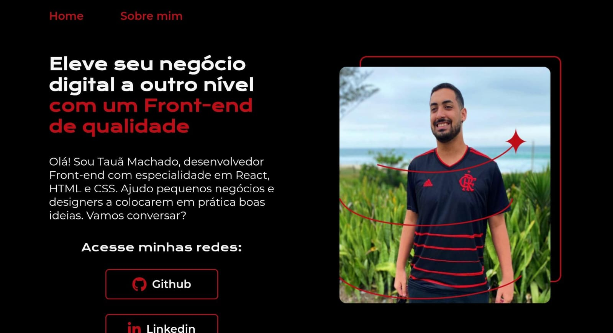

# Portifólio Profissional

## Descrição

Este projeto é uma Landing Page desenvolvida em **HTML** e **CSS**, com o objetivo de apresentar brevemente o desenvolvedor e disponibilizar links de contato importantes.

## Captura de Tela



## Tecnologias Utilizadas

- HTML
- CSS

## Como Executar o Projeto

1. Clone este repositório:
   ```bash
   git clone https://github.com/seu-usuario/seu-repositorio.git
   ```
2. Acesse a pasta do projeto:
   ```bash
   cd nome-do-repositorio
   ```
3. Abra o arquivo `index.html` no navegador.

## Link de Visita

Acesse o projeto online: [Portfólio Profissional](https://portfolioprofissional.vercel.app)

---

Este projeto foi desenvolvido dentro da Imersão Alura.

